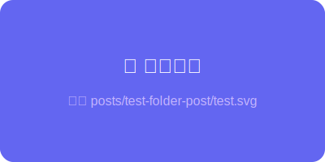

## 这是一篇文件夹结构的文章

文章和图片放在同一个文件夹下，不需要单独放到 `public/` 目录。

### 图片测试



上面的图片使用相对路径 `./test.svg` 引用，系统会自动转换为 API 路径。

### 代码测试

```typescript
const greeting = "Hello from folder post!";
console.log(greeting);
```

### 列表测试

- ✅ 文件夹结构识别
- ✅ 图片相对路径引用
- ✅ 文件夹名作为 slug
